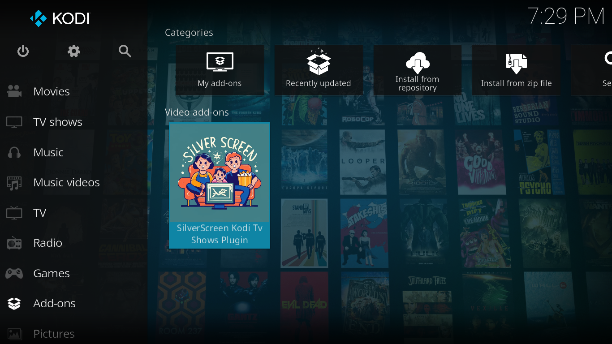
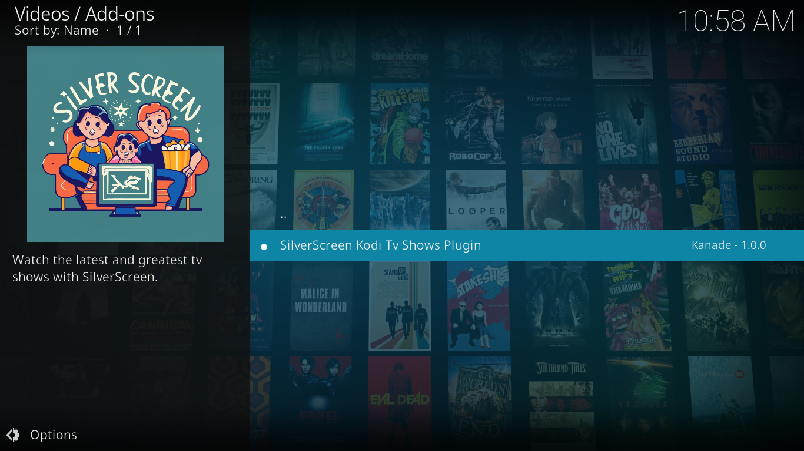
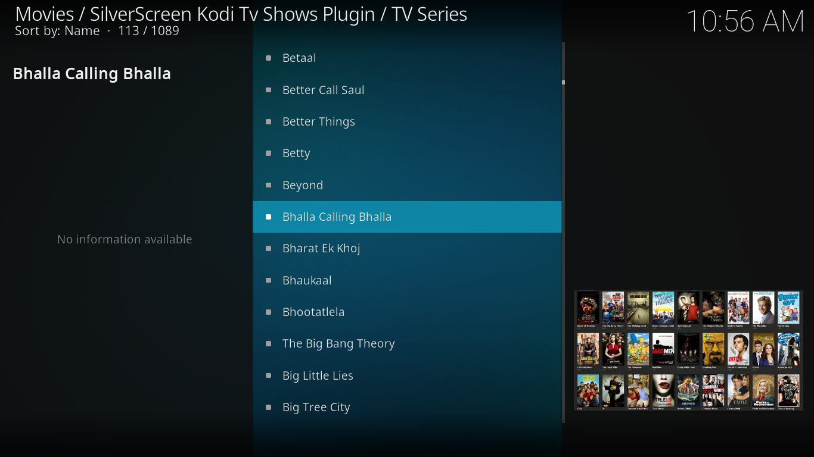
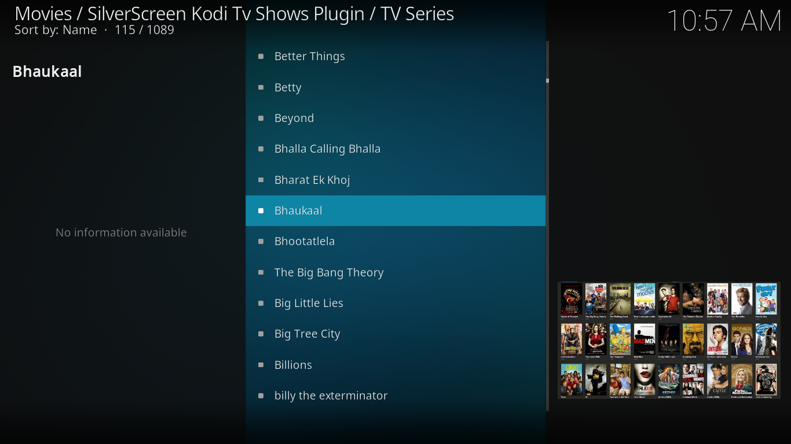
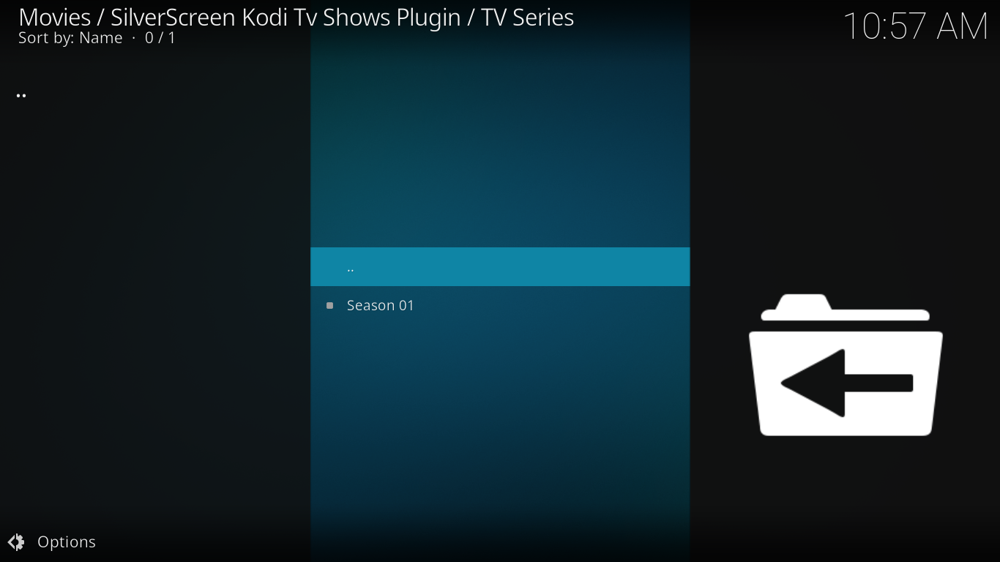
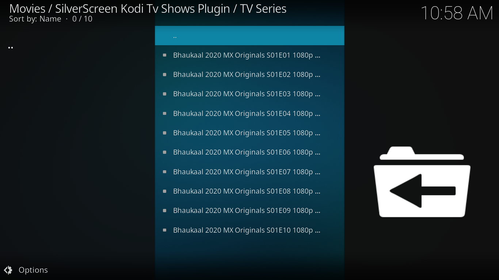

# SilverScreen Kodi Video Addon

SilverScreen is a Kodi addon that allows you to stream your favorite tv shows right from your Kodi media center. With a vast library of content and user-friendly interface, SilverScreen is your go-to solution for entertainment on Kodi.

## Features

- Extensive Library: Access a wide range of tv shows from various genres.

- Search Functionality: Easily find the content you love with the built-in search feature.

- User-Friendly Interface: SilverScreen's intuitive interface makes browsing and watching a breeze.

- High-Quality Streams: Enjoy high-definition streaming for a superior viewing experience.

- Regular Updates: Stay up-to-date with the latest content additions and features.

## Screenshots

## Installation

Follow these steps to install SilverScreen on your Kodi:

1. Launch Kodi on your device.

2. Navigate to the "Settings" icon (the gear symbol) on the Kodi home screen.

3. Click on "System."

4. Select "Add-ons" from the left sidebar.

5. Enable "Unknown sources" if it's not already enabled. This allows you to install addons from external sources.

6. Go back to the Kodi home screen and select "Add-ons" from the left sidebar.

7. Click on the "Package" icon (the open box) at the top left corner.

8. Choose "Install from zip file."

9. Locate the downloaded zip file.

10. Select "plugin.video.silverscreen.zip"

11. Wait for the installation confirmation message.

Now you're ready to enjoy SilverScreen on Kodi!

## Usage

1. Launch SilverScreen from your Kodi's "Add-ons" section.

2. Browse through the extensive library of tv shows.

3. Use the search function to find specific content.

4. Select a title to start streaming.

## Disclaimer

SilverScreen is a third-party Kodi addon. Ensure that you are using it in compliance with copyright laws and regulations in your region. We do not endorse or promote any form of copyright infringement.

## Support

For any issues, questions, or feedback related to SilverScreen, do not hesitate to open an issue.

Enjoy your cinematic experience with SilverScreen!
